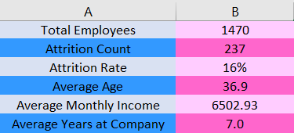
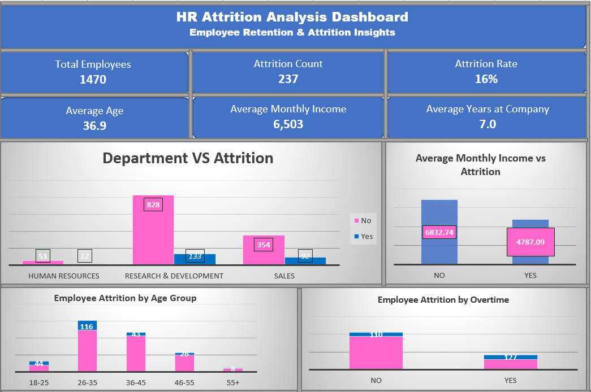
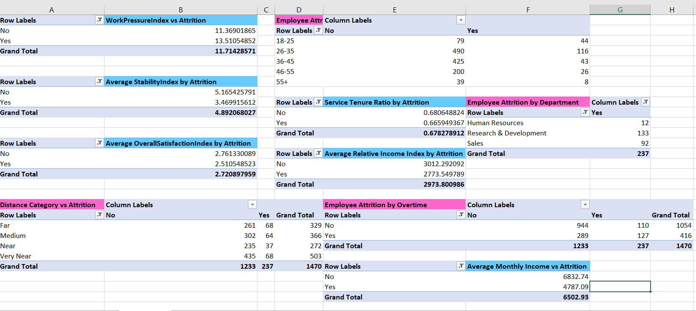

# HR Attrition Analysis Dashboard

## Project Overview

This project analyzes employee attrition using Microsoft Excel.

The project focuses on identifying the factors affecting employee turnover through data cleaning, feature engineering, KPI development, Pivot Tables, and dashboard visualization.

---

# Dataset Preparation

## Data Cleaning

The dataset was prepared and cleaned before analysis by:

* Removing duplicate records.
* Handling missing and blank values.
* Standardizing categorical variables.
* Validating data consistency.
* Preparing data for KPI calculations and dashboard reporting.

---

# Feature Engineering

To improve the analysis, several new features were created.

## DistanceCategory

Created DistanceCategory feature to classify employees according to their distance from work:

* Very Near
* Near
* Medium
* Far

This helped analyze the relationship between commuting distance and employee attrition.

---

## Age_Group

Created Age_Group feature to segment employees into:

* 18-25
* 26-35
* 36-45
* 46-55
* 55+

This enabled age-based attrition analysis.

---

## StabilityIndex

Created StabilityIndex feature to measure employee stability using tenure, promotions, and managerial experience indicators.

This feature helps identify workforce retention patterns.

---

## OverallSatisfactionIndex

Created OverallSatisfactionIndex feature by combining employee satisfaction indicators into a single metric.

This provides a broader view of employee engagement and satisfaction.

---

## WorkPressureIndex

Created WorkPressureIndex feature to estimate employee workload and work-related pressure factors.

This supports analysis of stress-related attrition drivers.

---

## ServiceTenureRatio

Created ServiceTenureRatio feature

to measure employee loyalty relative to career length.

This feature helps evaluate long-term employee commitment and retention behavior.

---

## RelativeIncomeIndex

Created RelativeIncomeIndex feature

to compare employee salary against age and experience profile.

This feature enables fair salary comparison across different employee groups.

---

# KPI Dashboard

The dashboard includes:

* Total Employees
* Attrition Count
* Attrition Rate
* Average Age
* Average Monthly Income
* Average Years at Company

## KPI Preview

---

# Dashboard Visualization

The dashboard was developed using Excel Pivot Charts and KPI Cards to provide interactive HR insights.

## Dashboard Preview

---

# Pivot Table Analysis

The following analyses were performed:

* Department vs Attrition
* Age Group vs Attrition
* Overtime vs Attrition
* Distance Category vs Attrition
* Average Monthly Income vs Attrition
* Stability Index vs Attrition
* Work Pressure Index vs Attrition
* Overall Satisfaction Index vs Attrition
* Relative Income Index vs Attrition
* Service Tenure Ratio vs Attrition

## Pivot Tables Preview

---

# Key Insights

* Employees working overtime tend to show higher attrition rates.
* Attrition is concentrated within specific age groups.
* Employee satisfaction is associated with retention behavior.
* Income level has a noticeable relationship with employee turnover.
* Distance from work impacts employee attrition patterns.
* Stability indicators provide strong retention signals.
* Different departments experience different attrition levels.

---

# Tools Used

* Microsoft Excel
* Pivot Tables
* Pivot Charts
* KPI Dashboard Design
* Data Cleaning
* Feature Engineering
* HR Analytics

---

# Author

**Sabrin Kater**

HR Attrition Analysis Project using Microsoft Excel.
